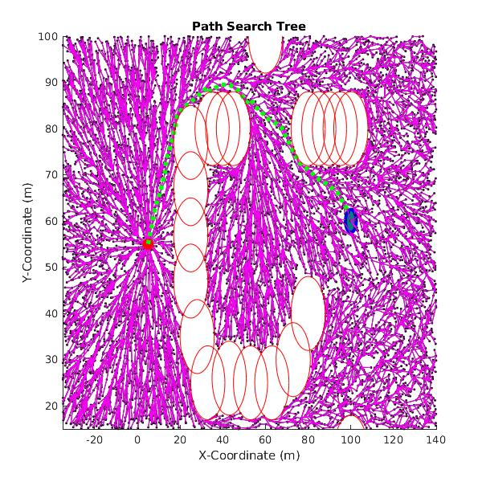

# RRT#

## Overview

This repository contains the source code for an RRT# implementation 

* `Anytime_RRT_Sharp`: Folder containing the source code for the RRT# algorithm.
* `s_function`: Folder for the MatLab S-function implementation of the path-planning algorithm.

## RRT# Algorithm

The RRT# algorithm is an improvement on the standard RRT* algorithm, which is an optimized variant of the RRT sample-based planning algorithm. A great deal of information is available publicly for both the RRT and RRT* algorithms. Generally, the RRT algorithm is a non-optimal non-deterministic sample-based feasibility algorithm which determines whether a path exists between two given nodes in a defined freespace. A path is formed by randomly sampling the freespace and attempting to connect the sampled node to an existing node. Two nodes are connected by an edge; the full set of nodes and edges is referred to as the graph.

RRT* is an optimal non-deterministic sample-based motion planning algorithm which optimizes the RRT process by considering multiple existing nodes when attempting to add a node to the existing graph. Newly sampled nodes are first connected to the cheapest node in the current graph structure. Surrounding nodes are then tested to see if it is cheaper for any of the surrounding nodes to use the newly added node as their parent; if so, the graph is rewired to use the cheaper path. Subsequent cost updates caused by this rewiring are *not* immediately propagated throughout the graph. These are instead propagated naturally as additional nodes are sampled and further rewiring is done.

RRT# improves upon RRT* by immediately propagating the cost updates resulting from rewiring throughout the graph. This results in a more rapid convergence to an optimal path.

## C++ Implementation

### Parameters

There are several key parameters which can be modified to achieve the desired output from the algorithm. These are listed below.

* **maxCount**: The maximum number of samples that will be taken in the freespace. The algorithm will continue to sample and optimize until this maximum number is reached.
* **k**: The number of neighbors that will be considered during rewiring. More neighbors will generally result in a longer runtime, but can result in a more optimal path.
* **epsilon**: The maximum extension amount used when connecting two nodes. If the distance between two nodes (one sampled, one in the graph) is greater than epsilon, than a new node will be added to the graph that is epsilon distance away from the node in the graph, in the direction of the sampled node.
* **rootXPosition/rootYPosition**: Coordinates for the desired final location of the path. This will be the root of the graph.
* **uavStartX/uavStartY**: Coordinates for the UAV current position. The graph will grow towards this location.
* **uavGoalRadius**: A radius that is considered acceptably close to the UAV's current position. Any path that starts within this radius is considered acceptable. Increasing this can result in more rapid path determination, but can impact the UAV's ability to follow the path.
* **obstacleXPosition/obstacleYPosition**: Location of circular obstacles the planning algorithm will plan around.
* **obstacleRadius**: Radii of the circular obstacles.

### Compiling

The source code must be compiled against the C++11 standard. An example is shown below using the g++ compiler version 5.4.0 in an environment running Ubuntu 16.04; this will produce an executable file called `RRT_Sharp`.

```
g++ RRT_Sharp.cpp workspaceGraph.cpp configspaceGraph.cpp --std=c++11 -o RRT_Sharp
```

### Running

To run the algorithm just call the executable.

```
./RRT_Sharp
```

Some logging messages will be printed to the terminal as the algorithm is running. A sample of successful logging messages are shown below.

```
Constructing a default empty workspace graph.
Constructing a default empty configspace graph.
Max Vehicle Radius: 0.707107
ObsVol: 4624.420480, NumObs: 23, NumVehicles: 1, Freespace: [-35.000000, 140.000000, 15.000000, 100.000000]
UAV Location: 100.000000, 60.000000, 2.500000
Root Node:    5.000000, 55.000000, 1.570796
Total number of points: 5611
Final node at: (98.851854, 62.243620)
Final cost is: 178.913123
Printing nodes to nodes_1.txt.
Printing edges to edges_1.txt.
Printing search tree to search_tree_1.txt.
Printing output path to output_path_1.txt.
Deleting a configspace graph.
Deleting a workspace graph.
```

The following files will be generated on completion:

* **nodes_1.txt**: A text file containing graph node information. The first line is the total number of nodes. Subsequent lines contain information on each node as `[x coord], [y coord], [theta angle], [id]`.
* **edges_1.txt**: A text file containing graph edge information. The first line is the total number of edges. Subsequent lines contain information on each edge as `[start node id], [end node id]`.
* **search_tree_1.txt**: A text file containing information on the full graph search tree. Each line contains information on the tree as `[start node id], [start node x coord], [start node y coord], [end node id], [end node x coord], [end node y coord]`.
* **output_path_1.txt**: A text file containing information of the optimal path output from the RRT# algorithm. Each line contains information on the final path nodes as `[x coord], [y coord], [theta angle]`.

### Visualizing Results

The `display_search_basic.m` MATLAB script can be used to plot and visualize results from the algorithm. The script uses the text data files that are output by the algorithm on completion. The following parameters must be set in the script to properly visualize the results.

* **problemNum**: The number suffix used to determine which files will be ingested. E.g. if this equals 1, then data files ending in _1 will be used.
* **root_node**: The root node for the graph. This should align with the **rootXPosition** and **rootYPosition** in the algorithm.
* **uav_start**: The starting position for the UAV. This should align with the **uavStartX**, **uavStartY**, and **uavGoalRadius** in the algorithm.
* **obstacles_raw**: The location and radii of the circular obstacles. This information is read in from the **obstacles.txt** in the same directory as the script. The obstacles defined here should align with the **obstacleXPosition**, **obstacleYPosition**, and **obstacleRadius** in the algorithm.

On running the script, the results of the algorithm should be plotted and displayed. An example output path is shown below.



## MATLAB S-Function Implementation

***TODO***